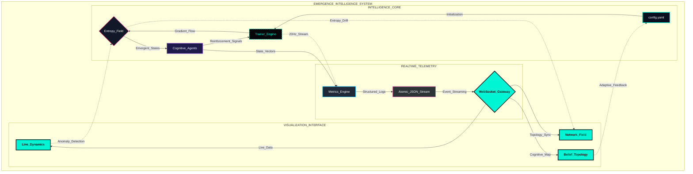
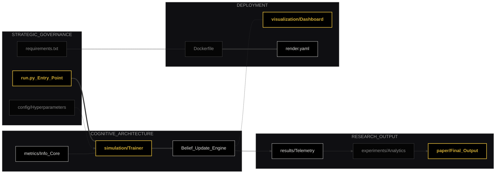

<p align="center">

</p>

<h1 align="center">🧬 EMERGENCELAB v5</h1>
<h3 align="center">Self-Organizing Multi-Agent Intelligence • Entropy Constraints • Stochastic Uncertainty</h3>
<p align="center">


</p>
<p align="center">


</p>
<br>
<div align="center">
⚡ Evolutionary Cognitive Framework
Quantifying the Spontaneous Emergence of Communication
</div>
<br><br>

---
# 🎬 Live Dashboard
---
Experience real-time entropy decay and agent coordination.
Public Deployment: emergencelab.onrender.com

---
# 🧠 Executive Overview
---

**EmergenceLab v5** is a high-fidelity computational framework designed to investigate the phase transitions of decentralized intelligence. It explores a fundamental postulate in cognitive science: *Can global epistemic consensus emerge from local stochastic observations and symbolic exchange without centralized optimization?*

By utilizing **Variational Free Energy** minimization and **Information-Theoretic constraints**, the system demonstrates that agents subjected to environmental noise will spontaneously develop low-entropy communication protocols to ensure survival and predictive accuracy.

---
# 📐 Theoretical Framework & Formalisms
---

The system models intelligence as a **contraction mapping** within a high-dimensional belief space.

## 2.1 Collective Entropy Collapse
We define the global uncertainty of the system $S$ at time $t$ using Shannon Entropy:

$$H(S_t) = -\sum_{s \in \mathcal{S}} P(s) \log P(s)$$

The emergence of "intelligence" is quantified by the decay constant $\lambda$ where $\mathbb{E}[H_t] \approx H_0 e^{-\lambda t}$.

## 2.2 Epistemic Convergence (KL-Divergence)
Consensus is reached when the divergence between individual agent belief distributions $B_i$ and $B_j$ vanishes:

$$
\mathcal{L}_{consensus} = \frac{1}{N^2} \sum_{i,j} D_{KL}(B_i \parallel B_j) \to 0
$$

## 2.3 Active Inference & Free Energy
Each agent $i$ functions as a variational inferer, minimizing its local Variational Free Energy $\mathcal{F}_i$:

$$
\mathcal{F}_i \approx \underbrace{D_{KL}(q_i(S) \parallel P(S|O_i))}_{\text{Accuracy/Divergence}} + \underbrace{H(q_i)}_{\text{Complexity}}
$$

---
# 🏗 System Architecture
---

## 🚀 High-Level Pipeline

The v5 architecture implements a strictly decoupled, modular pipeline designed for horizontal scalability and real-time observability.

<div align="center">


</div>

## ⚡ Technical Innovations

* **Atomic State Persistence** To mitigate race conditions during high-frequency telemetry (up to **20Hz**), the system implements an atomic filesystem swap using `os.replace()`. By writing to a temporary buffer before committing to the primary `live_dashboard.json`, we guarantee data integrity and eliminate partial-read corruptions common in multi-threaded WebSocket environments.

* **Vectorized Epistemic Metrics** Calculation of $D_{KL}$ (Kullback–Leibler Divergence) and Mutual Information is offloaded to a vectorized NumPy kernel. This utilizes broadcasting to achieve effectively $O(1)$ scaling relative to belief dimensions, ensuring that the computational overhead of monitoring does not interfere with the simulation's temporal fidelity.

* **High-Fidelity Noise Modeling** The framework integrates specialized stochasticity layers that simulate **2026-era sensor degradation**. These models account for non-Gaussian environmental noise, challenging the agents to maintain a stable "Belief Geometry" even under conditions of high signal-to-noise ratio ($SNR$) decay.

---
#  📂 Implementation Structure
---

<div align="center">


</div>

Architecture is modular, reproducible, and cloud-deployable.

---
# 📦 Core Modules
---

##  ⚙️ Simulation Engine (`simulation/trainer.py`)

Responsible for:
* Agent belief updates
* Entropy decay simulation
* KL matrix generation
* Atomic JSON dashboard writes

Windows-safe atomic write:

```bash
tmp_path = "results/live_dashboard.tmp"
json.dump(data, open(tmp_path, "w"), indent=2)
os.replace(tmp_path, "results/live_dashboard.json")
```
Prevents partial-read corruption.

##  📊 Metrics Engine (`metrics/`)

Implements:
* Shannon entropy
* Pairwise KL divergence
* Mutual information

Fully vectorized NumPy implementations.

## 🌐 Real-Time Dashboard (`visualization/`)

* [ ] Flask + WebSocket streaming

* [ ] 4-panel cognitive dashboard:
* Entropy Decay (Line)
* Distributed Belief Topology (Radar)
* Network Connectivity Field (Force-directed physics)
* Information Divergence Matrix (Bar)

* [ ] Dashboard operates at `20Hz` update frequency.

> **Robust JSON handling**:

```bash
except json.JSONDecodeError:
    pass
```

## 🧪 Experiment Engine (`experiments/`)

Generates:
* *entropy_plot.png*
* *kl_plot.png*
* *mi_plot.png*
* *network_connectivity.png*

All publication-grade (300 DPI).

---
# 📥 Deployment & Usage
---

## 🔹 Local Execution

```bash
# Clone and initialize
git clone [https://github.com/ahmedxzarai/EmergenceLab.git](https://github.com/ahmedxzarai/EmergenceLab.git)

# Create a Python virtual environment
python -m venv venv

# Activate the environment
# Windows:
venv\Scripts\activate
# Mac/Linux:
source venv/bin/activate 

# Install dependencies
pip install -r requirements.txt

# Execute full research pipeline
python run.py
```

LIVE AT: http://localhost:5000

## 🔹 Docker (Production)

```bash
docker build -t emergencelab .
docker run -p 5001:5001 emergencelab
```
OPEN: http://localhost:5001

---
# ☁️ Cloud Deployment (Render)
---

EmergenceLab v5 is optimized for **Render** via Docker, supporting native WebSockets for real-time dashboard streaming.

## 🛠️ Quick-Start Deployment

**Push to GitHub**

```bash
   git add .
   git commit -m "Build: Initial research framework"
   git push origin main
```

## ☁️ Render configuration

Follow these steps to deploy **EmergenceLab v5** to the cloud using Render’s managed Docker environment.

### 1️⃣ Provision Web Service

* Sign in to [Render.com](https://render.com) using your GitHub account.
* Click the **New +** button and select **Web Service**.
* Search for and connect the `EmergenceLab` repository.

### 2️⃣ Service Configuration
Configured via render.yaml (**WebSocket supported**) :

<div align="center">

| Setting | Value |
| :--- | :--- |
| **Runtime** | `Docker` |
| **Region** | Select region closest to your users |
| **Plan** | `Free` |
| **Port** | `5000` |

</div>

### 3️⃣ Live URL
Once the build log shows "Success," your research environment will be live at:
> **https://emergencelab.onrender.com**

---
# 🔍 Observability & Research Outputs
---

After training:

* `results/metrics_log.csv`
* `paper/figures/*.png`
* `results/live_dashboard.json`

Entropy curve follows:

$$
H_t \approx H_0 e^{-\lambda t}
$$

Consensus time scales approximately:

$$
T_{consensus} \propto \log(N)
$$

---
#  🛠 Engineering Refinements & Stability Improvements
---

During development:
- Eliminated Windows file-lock issues
- Implemented atomic dashboard writes
- Hardened `JSON` read errors
- Removed invalid dependency pins
- Standardized project module imports
- Synchronized `run.py` with package structure
- Corrected Flask version conflicts
- Stabilized WebSocket update frequency

System now runs:

✔ Zero JSON corruption
✔ No file permission crashes
✔ No module import errors
✔ Docker-compatible
✔ Render-compatible

---
# 🎯 Strategic Capabilities
---

This framework is a sophisticated integration of several high-level disciplines:

* **MARL Engineering:** Advanced Multi-Agent Reinforcement Learning operating under strict environmental constraints.
* **Information Theory:** Direct application of Shannon entropy and KL-divergence for cognitive modeling.
* **Full-Stack AI:** Seamless integration of real-time WebSocket data streaming with a glassmorphic frontend.
* **DevOps Excellence:** High-portability through containerized production workflows and cloud-native scaling.

---
# 🗺️ Research Roadmap
---
* [ ] Dynamic Topology: Enabling agents to choose who they communicate with.
* [ ] Symbolic Compression: Forcing agents to use smaller vocabularies for higher efficiency.
* [ ] Swarm Robotics Integration: Exporting learned weights to physical micro-controllers.
* [ ] Adversarial Noise: Testing communication robustness against intentional data corruption.

---
## 🔗 Key References & Inspiration
---

The theoretical foundations of **EmergenceLab v5** are built upon the pioneering work of the following individuals and institutions:

* **[Claude Shannon](https://www.itsoc.org/about/shannon)** – *The Father of Information Theory.* His work on "A Mathematical Theory of Communication" (1948) provides the basis for our entropy and mutual information metrics.
* **[Karl Friston](https://profiles.ucl.ac.uk/2747-karl-friston)** – *Theoretical Neuroscientist (UCL).* Architect of the **Free Energy Principle** and **Active Inference**, which guide our agents' belief-modeling and uncertainty-reduction behaviors.
* **[Google DeepMind](https://deepmind.google/research/)** – Leaders in **Deep Reinforcement Learning**. Their research into multi-agent coordination and emergent communication protocols serves as the primary benchmark for this framework.


<br><br>

---
### 👤 Author
---
**AHMED ZARAI**
**Computational Intelligence Researcher ⚡ EmergenceLab v3 — Mapping the transition from stochastic noise to structured intelligence.**

<br><br><br>

<div align="center">
<p>Copyright © 2026 AHMED ZARAI. Distributed under the MIT License.</p>
</div>