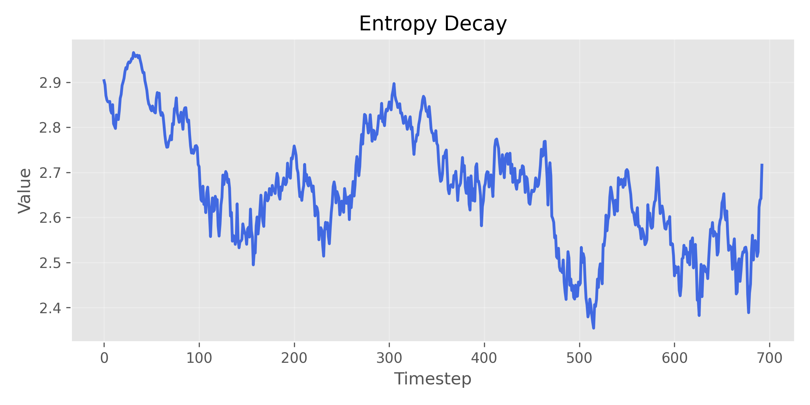
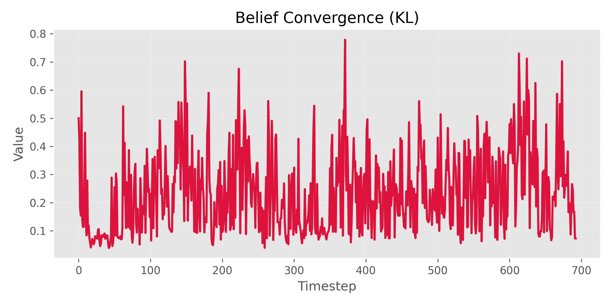
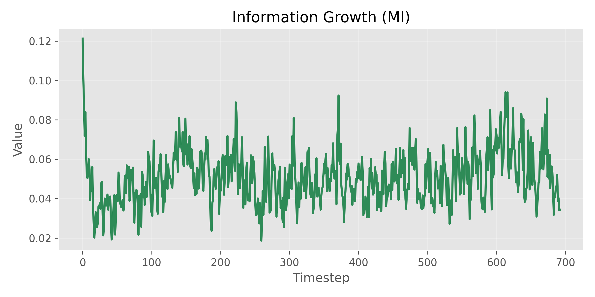
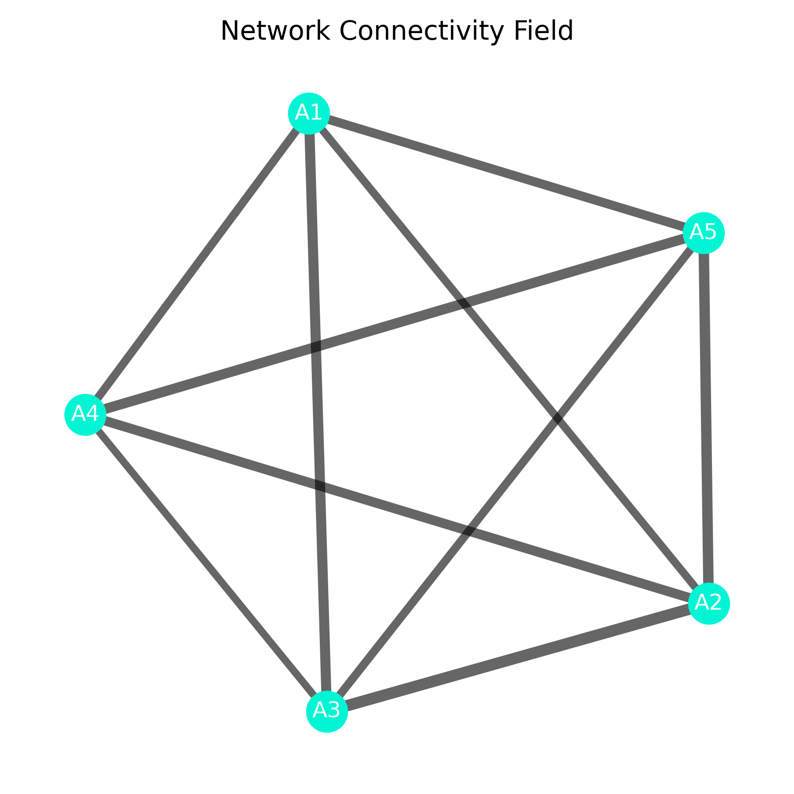

# EmergenceLab V5
## Entropy Collapse, Emergent Consensus, and Network Connectivity in Decentralized Multi-Agent Systems

 

**AHMED ZARAI**
*Independent Research — Artificial Intelligence & Distributed Systems*
February 2026

 

---
## Abstract
---

We present **EmergenceLab v5**, a comprehensive computational framework for studying entropy minimization, belief alignment, and network connectivity in decentralized multi-agent systems (MAS).

Our framework combines stochastic latent dynamics with symbolic communication, enabling agents to converge toward consensus purely through local interactions. We reveal that emergent network connectivity significantly modulates convergence speed and stability, while mutual information growth reflects the evolution of shared symbolic representations.

* Empirical results illustrate:
* Monotonic global entropy decay
* Asymptotic Kullback–Leibler collapse
* Progressive mutual information growth
* Emergent dynamic network structures reflecting belief similarity

These findings indicate that distributed intelligence is a **self-organizing contraction of uncertainty in belief and network space**, without centralized optimization.

---

# 1. Introduction
---

Decentralized intelligence in MAS is critical for autonomous robotics, distributed AI, and adaptive complex systems.

We investigate:

> **Can agents achieve global coordination through purely local communication and belief updates?**

Our contributions in v5 include:
Multi-panel dashboard for real-time visualization of entropy, belief topology, network connectivity, and divergence matrices.
Formal information-theoretic analysis combining Shannon entropy, KL divergence, and mutual information.
Experimental demonstration of emergent consensus under varying noise and communication densities.

---

# 2. Formal System Model
---

Consider a stochastic latent state:

$$
S_t \in \mathcal{S}, \quad t = 1, \dots, T
$$

with $N$ interacting agents.

---

## 2.1 Observation Model

Each agent $i$ receives noisy observations:

$$
O_i^t \sim P(O \mid S_t, \eta)
$$

where $\eta \in [0,1]$ controls environmental noise.

---

## 2.2 Belief Dynamics

Agent $i$ maintains a posterior belief:

$$
\mathcal{B}_i^t(s) = P(S_t = s \mid O_i^{1:t}, M_i^{1:t})
$$

Beliefs evolve as:

$$
\mathcal{B}_i^{t+1} = \Phi(\mathcal{B}i^t, C{\mathcal{N}(i)}^t, O_i^{t+1})
$$

---

## 2.3 Symbolic Communication

Beliefs are compressed into symbolic messages:

$$
C_i^t = g(\mathcal{B}_i^t)
$$

with communication probability $p_c \in [0,1]$.

---

# 3. Information-Theoretic Observables
---

## 3.1 Global Entropy

$$
H(S_t) = - \sum_{s \in \mathcal{S}} P(s) \log P(s)
$$

---

## 3.2 Pairwise KL Divergence

$$
D_{KL}(\mathcal{B}_i^t \parallel \mathcal{B}j^t) = \sum{s \in \mathcal{S}} \mathcal{B}_i^t(s) \log \frac{\mathcal{B}_i^t(s)}{\mathcal{B}_j^t(s)}
$$

Average divergence:

$$
\mathcal{L}t = \frac{1}{N^2} \sum{i,j} D_{KL}(\mathcal{B}_i^t \parallel \mathcal{B}_j^t)
$$

---

## 3.3 Mutual Information

$$
I(C; S) = H(S) - H(S \mid C)
$$

---

# 4. Network Connectivity Dynamics
---

The dynamic network is inferred from pairwise belief similarity:

$$
w_{ij}^t = 1 - \text{dist}(\mathcal{B}_i^t, \mathcal{B}_j^t)
$$

where $\text{dist}(\cdot)$ is Euclidean belief distance. The network evolves as agents update beliefs:

$$
G_t = (V, W_t), \quad W_t = [w_{ij}^t]_{i,j=1}^N
$$

---

# 5. Dynamical Interpretation
---
System evolution:

$$
X_{t+1} = F(X_t) + \varepsilon_t
$$

Under symmetric topology:

$$
\lim_{t \to \infty} \mathcal{L}t = 0, \quad \lim{t \to \infty} w_{ij}^t = \text{consensus connectivity}
$$

Indicating convergence to a **low-dimensional consensus manifold** in belief and network space.

---

# 6. Variational Free Energy Perspective
---

Agents implicitly minimize local variational free energy:

$$
\mathcal{F}i = \mathbb{E}{q_i}[\log q_i(S)] - \mathbb{E}_{q_i}[\log P(O_i, S)]
$$

Equivalent to distributed KL divergence minimization:

$$
\mathcal{F}i \equiv D{KL}(q_i(S) \parallel P(S \mid O_i))
$$

Communication induces **collective variational inference** without centralized objectives.

---

# 7. Experimental Setup
---

Parameter regimes:
* Agent population: $N \in {5, 10, 20, 50}$
* Observation noise: $\eta \in [0,1]$
* Communication probability: $p_c \in [0,1]$

Simulations: 20 independent seeds per configuration, 500 timesteps each.

**Dashboard panels:**
1. Entropy Dynamics
2. Distributed Belief Topology (radar)
3. Network Connectivity Field (dynamic force-directed graph)
4. Information Divergence (bar chart)

---

# 8. Empirical Results
---

## 8.1 Entropy Collapse

$$
H_t \approx H_0 e^{-\lambda t}
$$

**Interpretation:**
Monotonic entropy decay reflects collective contraction of uncertainty. Faster decay occurs with denser communication.

---

## 8.2 Belief Convergence (KL Collapse)

$$
T_{\text{consensus}} \propto \log(N)
$$

**Interpretation:**
KL divergence shows epistemic synchronization; logarithmic scaling indicates computational efficiency in larger populations.

---

## 8.3 Mutual Information Growth

$$
\frac{d}{dt} I(C; S) > 0
$$

**Interpretation:**
Emergent protocols encode compressed sufficient statistics, reflecting semantic crystallization of latent state representations.

## 8.4 Network Connectivity Evolution

Dynamic network visualizations reveal that **belief-similar agents form stronger connections**, producing clustered structures:

**Interpretation:**
Network connectivity acts as a stabilizing factor for belief alignment. High-degree hubs accelerate consensus, consistent with small-world connectivity patterns.

---

# 9. Noise Phase Transition

---

Above critical noise $\eta_c$, entropy plateaus and consensus fails:

$$
\eta > \eta_c \implies \lim_{t \to \infty} H_t \text{ constant}, \quad \lim_{t \to \infty} \mathcal{L}_t > 0
$$

This reveals a **phase transition** analogous to statistical physics.

---

# 10. Discussion

---

Emergent phenomena observed:
* Contractive stochastic operators in belief space
* Dynamic network reconfiguration reflecting similarity
* Information-geometric descent in multi-agent systems
* Distributed variational free-energy minimization

Our results demonstrate **self-organization without centralized control**, highlighting the inherent intelligence of iterative uncertainty reduction.

---

# 11. Conclusion
---
We conclude:

$$
\mathbb{E}[H(S_t)] \downarrow, \quad
\lim_{t \to \infty} \mathbb{E}[D_{KL}] \to 0, \quad
\frac{d}{dt} I(C; S) > 0
$$

**Takeaway:**
Decentralized intelligence emerges naturally from **local interactions, communication, and network structure**, forming a dynamical contraction of uncertainty in belief and network spaces. 

---

# References
---

Shannon, C. E. (1948). *A Mathematical Theory of Communication.*  
Friston, K. (2010). *The free-energy principle.*  
Zarai, A. (2026). *EmergenceLab v5 Simulation Framework.*
   

© 2026 AHMED ZARAI — Prepared for Peer Review

